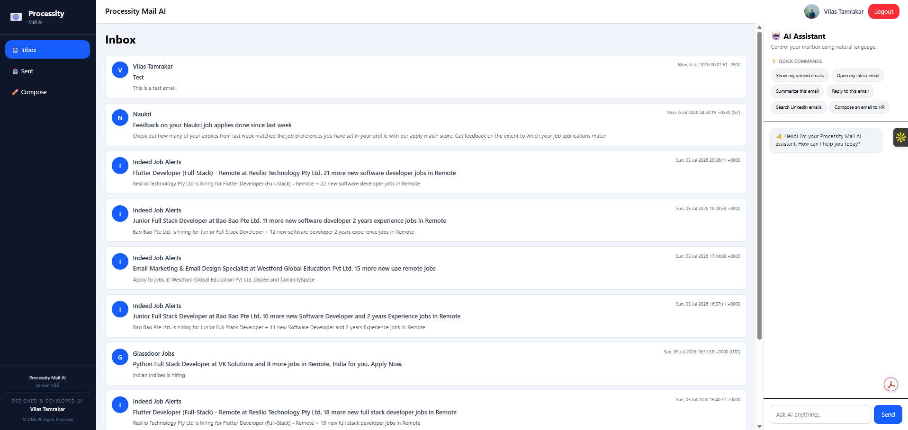
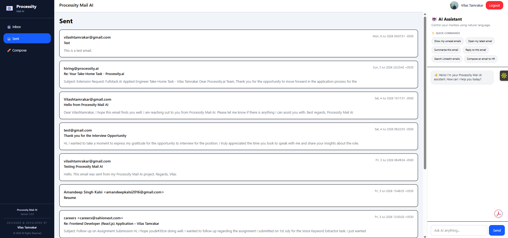
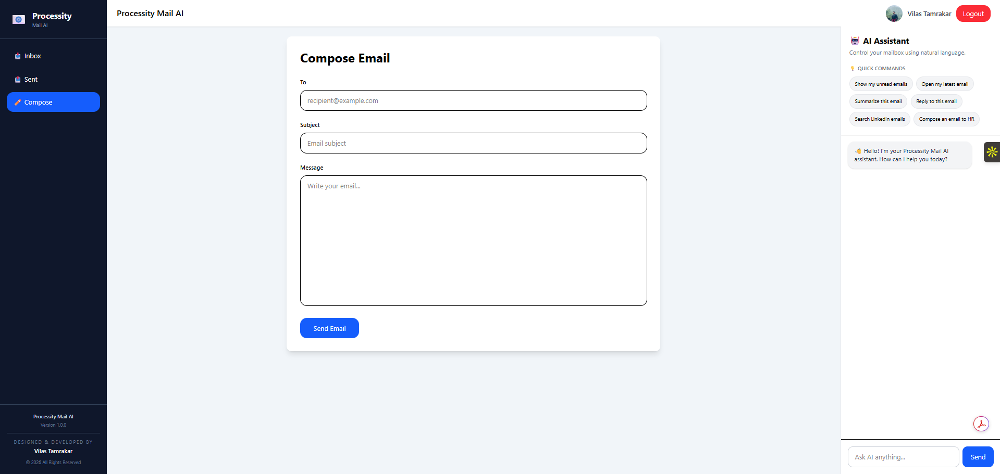

# 📧 MailPilot AI Mail Assistant

An AI-powered Gmail client built with the MERN stack that enables users to manage their inbox using natural language. The application integrates Google OAuth for authentication, Gmail API for email management, and OpenAI GPT-4.1 Mini to provide intelligent email assistance such as summarization, reply generation, email drafting, and smart search.

---

## 🚀 Live Demo

### 🌐 Live Application
https://processity-mail-ai-iota.vercel.app

### 🎥 Demo Video
https://drive.google.com/file/d/1nQO06Esm97REk-KHbaAZwe4yw2ThRbsA/view?usp=sharing

### 💻 GitHub Repository
https://github.com/Vilas317/processity-mail-ai

### ⚙️ Backend API
https://processity-mail-ai-2j8z.onrender.com

---

# 📌 Project Overview

MailPilot AI Mail Assistant is an intelligent email client that combines Gmail with AI-powered productivity features.

Users can securely authenticate with their Google account, browse inbox and sent emails, compose new emails, and interact with an AI assistant using natural language.

The AI Assistant understands user intent and performs actions like:

- Summarizing emails
- Drafting professional replies
- Composing new emails
- Opening recent emails
- Searching emails
- Displaying unread emails

The goal is to simplify email management through conversational AI.

---

# ✨ Features

## 🔐 Authentication

- Google OAuth 2.0 Login
- Secure Session Authentication
- Persistent Login
- Logout Support

---

## 📥 Email Management

- View Inbox
- View Sent Emails
- Open Email Details
- Responsive Email Cards
- Read Email Content

---

## ✍️ Compose Emails

- Compose new emails
- Send emails using Gmail API
- AI-generated email drafts
- Auto-filled compose form from AI Assistant

---

## 🤖 AI Assistant

Natural language powered assistant capable of:

- Show unread emails
- Open latest email
- Summarize current email
- Reply to current email
- Search emails
- Compose professional emails

---

## 🎨 User Interface

- Clean modern dashboard
- Responsive layout
- Sidebar Navigation
- Toast Notifications
- Dark Mode (Login Screen)
- AI Chat Panel
- Loading States

---

# 🛠 Tech Stack

## Frontend

- React.js
- React Router DOM
- Tailwind CSS
- Axios
- React Hot Toast
- Context API

## Backend

- Node.js
- Express.js

## Authentication

- Passport.js
- Google OAuth 2.0
- Express Session

## AI

- OpenAI GPT-4.1 Mini

## Email

- Gmail API
- Google APIs

## Deployment

- Vercel (Frontend)
- Render (Backend)

---

# 📸 Screenshots

## Login


---

## Login (Dark Mode)


---

## Inbox



---

## Sent Emails



---

## Compose Email



---

## AI Assistant


---

## AI - Show Unread Emails


---

## AI - Summarize Email


---

## AI - Reply to Email


---

## AI - Compose Email


---

# 🧠 AI Commands

Example prompts supported by the assistant:

```
Show my unread emails
```

```
Open my latest email
```

```
Summarize this email
```

```
Reply to this email
```

```
Search LinkedIn emails
```

```
Compose an email to HR
```

---

# 📂 Project Structure

```
Mailpilot
│
├── client
│   ├── src
│   ├── public
│   └── package.json
│
├── server
│   ├── controllers
│   ├── routes
│   ├── services
│   ├── middleware
│   ├── config
│   └── package.json
│
└── README.md
```

---

# ⚙️ Installation

## Clone Repository

```bash
git clone https://github.com/Vilas317/processity-mail-ai.git
```

```
cd processity-mail-ai
```

---

## Backend

```
cd server
npm install
npm run dev
```

---

## Frontend

```
cd client
npm install
npm run dev
```

---

# 🔑 Environment Variables

## Backend (.env)

```
PORT=5000

CLIENT_URL=http://localhost:5173

SESSION_SECRET=your_secret

GOOGLE_CLIENT_ID=your_client_id

GOOGLE_CLIENT_SECRET=your_client_secret

OPENAI_API_KEY=your_openai_api_key
```

---

# 🚀 Future Improvements

- Complete dark mode across authenticated pages
- AI email categorization
- AI priority detection
- Email labels & folders
- Rich text editor
- Attachments support
- Voice commands
- AI smart follow-up reminders
- Multi-account Gmail support

---

# 👨‍💻 Author

**Vilas Tamrakar**

GitHub:
https://github.com/Vilas317

LinkedIn:
https://www.linkedin.com/in/vilas-tamrakar/

---
